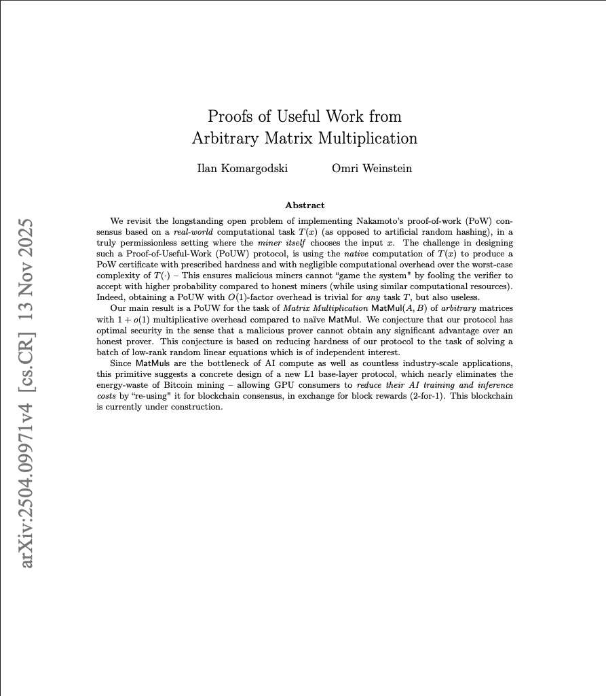

Finally, we can do some useful work when mining crypto! The paper [Proofs of Useful Work from Arbitrary Matrix Multiplication](https://arxiv.org/abs/2504.09971) shows that instead of securing the Bitcoin network by checking hashes, a fundamentally useless operation, we can instead use matrix matrix multiplication, a very useful operation, to secure the network.

This means that if when we run our AI models, we can use that very matmul to mine for crypto for free, at the same time! Dope work! I implemented the algorithm in main.ipynb.

    

